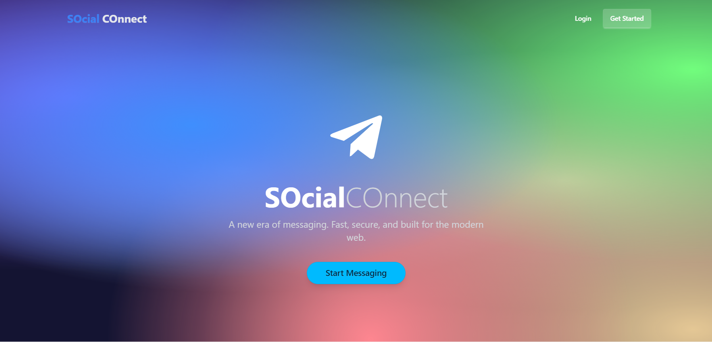
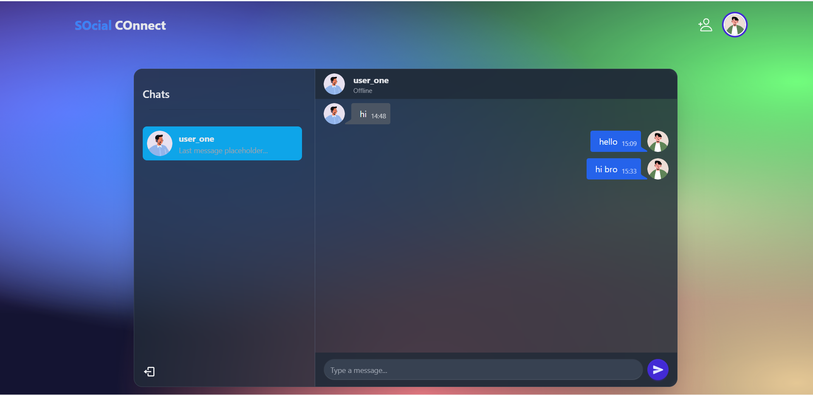
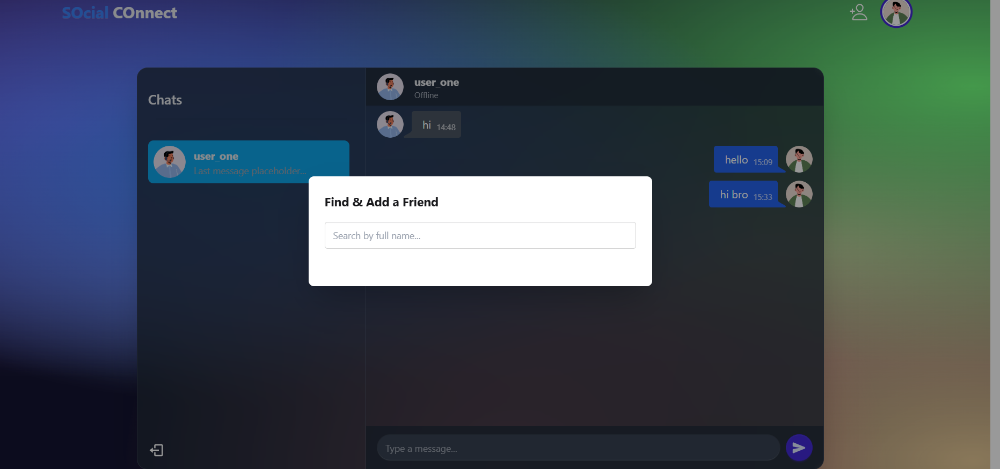

# SOcial COnnect 🚀

A modern, real-time messaging web application built with the MERN stack (MongoDB, Express.js, React.js, Node.js) and Socket.IO. Inspired by the clean and fluid user experience of applications like Telegram.



## About The Project

SOcial COnnect is a feature-rich chat application designed for seamless communication. It allows users to create accounts, find other users, send friend requests, and engage in real-time, one-on-one conversations. The project emphasizes a modern design aesthetic, a robust backend, and an intuitive user interface.

### Built With

This project is built on a powerful and popular technology stack:

*   **MongoDB:** NoSQL database for storing user, conversation, and message data.
*   **Express.js:** Backend framework for building robust APIs.
*   **React.js:** Frontend library for a dynamic and responsive user interface.
*   **Node.js:** JavaScript runtime for the server-side logic.
*   **Socket.IO:** For enabling real-time, bidirectional communication.
*   **Tailwind CSS & DaisyUI:** For modern, component-based styling.
*   **Zustand:** For simple and effective global state management.
*   **JWT (JSON Web Tokens):** For secure user authentication.

---

## 📸 Screenshots

<table>
  <tr>
    <td align="center"><strong>Chat Interface</strong></td>
    <td align="center"><strong>Add Friend Modal</strong></td>
  </tr>
  <tr>
    <td></td>
    <td></td>
  </tr>
</table>

---

## ✨ Features

*   **User Authentication:** Secure signup, login, and logout functionality using JWT and cookies.
*   **Real-Time Messaging:** Instant message delivery and online status indicators powered by Socket.IO.
*   **Friend Request System:**
    *   Search for any user on the platform.
    *   Send friend requests.
    *   View incoming requests.
    *   Accept or Decline requests to form mutual friendships.
    *   Remove existing friends.
*   **Chat Management:**
    *   Delete your own messages from a conversation.
    *   Clean and intuitive chat interface.
*   **Modern & Responsive Design:**
    *   A beautiful, animated landing page for new visitors.
    *   Cohesive, Telegram-inspired design across the application.
    *   Stylish and user-friendly modals and notifications.

---

## 🛠️ Getting Started

To get a local copy up and running, follow these simple steps.

### Prerequisites

Make sure you have the following software installed on your machine:

*   **Node.js** (v18 or later recommended) - [Download Here](https://nodejs.org/)
*   **npm** (comes with Node.js)
*   **Git** for version control - [Download Here](https://git-scm.com/)
*   **MongoDB Server** (or use a cloud service like MongoDB Atlas)
    *   For local development, you can install MongoDB Community Server: [Installation Guide](https://www.mongodb.com/docs/manual/installation/)
    *   A GUI like **MongoDB Compass** is highly recommended for viewing data: [Download Here](https://www.mongodb.com/products/compass)

### Installation & Setup

1.  **Clone the repository:**
    ```bash
    git clone https://github.com/your-username/your-repo-name.git
    cd your-repo-name
    ```

2.  **Setup the Backend:**
    *   Navigate to the backend directory:
        ```bash
        cd backend
        ```
    *   Install the required npm packages:
        ```bash
        npm install
        ```
    *   Create a `.env` file in the `backend` directory. Copy the contents from `.env.example` (or the block below) and fill in your details.
        ```
        # Create a new file named .env and add this content
        
        # Your MongoDB connection string (local or cloud)
        # For a local database, this is usually correct
        MONGO_DB_URI=mongodb://127.0.0.1:27017/social-connect-db

        # A strong, random secret key for signing JWTs
        # You can generate one by running `openssl rand -base64 32` in your terminal
        JWT_SECRET=your_super_strong_jwt_secret_key

        # The port your backend server will run on
        PORT=5000
        ```

3.  **Setup the Frontend:**
    *   Navigate to the frontend directory from the root folder:
        ```bash
        cd frontend
        ```
    *   Install the required npm packages:
        ```bash
        npm install
        ```

### Running the Application

You will need **three separate terminals** running simultaneously to launch the application.

1.  **Terminal 1: Start your MongoDB Server.**
    *   If you installed MongoDB locally, you'll need to start the service. On most systems, this is done with a command like:
        ```bash
        mongod
        ```

2.  **Terminal 2: Start the Backend Server.**
    *   Navigate to the `backend` directory and run:
        ```bash
        npm start
        ```
    *   You should see the output: `Server is running on port 5000` and `Connected to MongoDB`.

3.  **Terminal 3: Start the Frontend Development Server.**
    *   Navigate to the `frontend` directory and run:
        ```bash
        npm run dev
        ```
    *   Your browser should automatically open to `http://localhost:3000`, where you can see the application running.

You are now all set! You can create a few different user accounts to test the friend request and real-time chat functionality.

---
